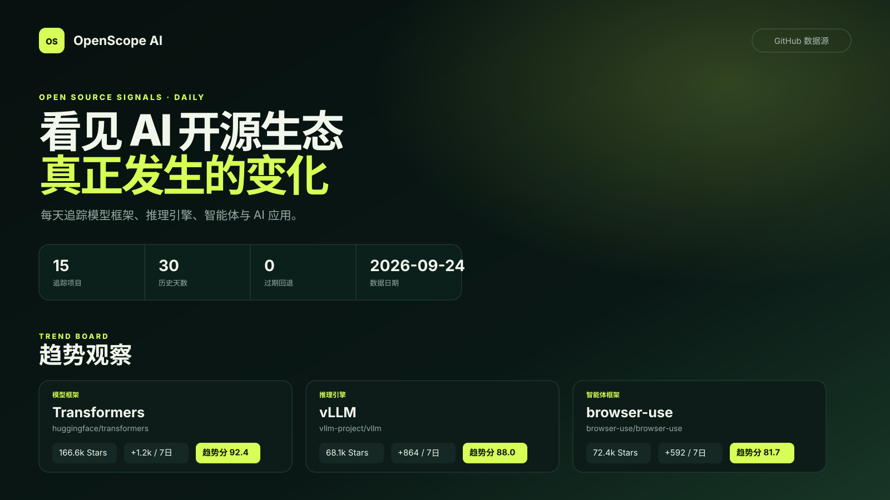

# OpenScope AI

OpenScope AI 是一个面向学生的 AI 开源项目观察站。它每天读取 15 个公开 GitHub 仓库的数据，展示 Star 变化、最近推送、版本发布和高讨论度 Issue，并生成一份中文周报。

> 热度反映关注与活跃变化，不代表项目质量。



上图是随仓库保存的确定性界面示意图，不是实时数据截图。网站部署后会读取 `site/data/dashboard.json` 展示最新公开数据。

## 它会自动做什么

- 每天 06:30（Asia/Shanghai）由 GitHub Actions 采集一次数据。
- 保存最近 365 天的历史，满 7 天显示短期变化，满 30 天显示完整趋势分。
- 生成响应式中文网页和每周 Markdown 报告。
- 某个仓库失败时沿用上次成功数据并标记“数据可能过期”。
- 超过 20% 的仓库失败时停止发布，保留上一版网站。

## 本地运行

需要 Python 3.12 或更高版本。下面的命令不会访问 GitHub，只验证本地历史并生成页面数据：

```bash
python3.12 -m venv .venv
source .venv/bin/activate
python -m pip install -e ".[dev]"
python -m pytest -q
python -m ruff check .
python -m openscope.cli build --offline
python -m http.server 8000 --directory site
```

然后打开 `http://localhost:8000`。如果电脑没有 `python3.12` 命令，可先从 Python 官方网站安装 Python 3.12，再重试。

联网采集使用：

```bash
GITHUB_TOKEN=你的令牌 python -m openscope.cli collect
```

令牌只通过环境变量传入，绝不能写入代码、YAML、截图或提交记录。公开仓库的小规模测试可不设置令牌，但更容易遇到 GitHub 速率限制。

## 修改追踪清单

编辑 `config/repos.yaml`。每个项目必须包含：

```yaml
- full_name: owner/repository
  display_name: 页面显示名称
  category: 分类名称
  reason: 为什么值得观察
  what_it_is: 这个项目是什么
  why_use_it: AI 应用开发者为什么会使用它
  use_cases:
    - 典型应用场景一
    - 典型应用场景二
```

`full_name` 必须唯一，并严格使用 `owner/repository` 格式。`use_cases` 至少包含两个非空场景。介绍内容会出现在项目详情中，并参与中文搜索；修改后先运行测试，再提交。

## 手动运行自动任务

1. 打开 GitHub 仓库的 **Actions** 页面。
2. 选择 **Update data and deploy Pages**。
3. 点击 **Run workflow**，选择 `main` 后确认。
4. 等待 `update` 和 `deploy` 两个任务变绿；失败时展开红色步骤查看日志。

工作流只使用 GitHub 自动提供的 `GITHUB_TOKEN`，不需要自己创建付费 API 密钥。

## 启用 GitHub Pages

1. 将仓库设为公开，并确保默认分支名为 `main`。
2. 打开 **Settings → Pages**。
3. 在 **Build and deployment** 的 Source 中选择 **GitHub Actions**。
4. 回到 Actions 页面手动运行一次更新工作流。
5. 部署完成后，网页地址通常是 `https://你的用户名.github.io/open-source-ai-observatory/`。

GitHub 可能在高峰期延迟定时任务。公开仓库连续 **60 天** 没有活动时，GitHub 也可能自动停用 scheduled workflow；进入 Actions 页面重新启用并手动运行一次即可恢复。

## 隐私与安全

- 网站没有登录、Cookie、分析脚本或访客信息收集。
- 只读取 GitHub 公共 REST API，不抓取其他网站。
- 页面展示的每个项目、Release 和 Issue 都链接回原始 GitHub 页面。
- Actions 仅获得提交历史数据和发布 Pages 所需的权限。
- `GITHUB_TOKEN` 只存在于运行环境中，生成的 JSON 不包含令牌或私钥字段。

## 限制

- 趋势分衡量的是这 15 个项目之间的相对关注和活跃变化，不评价代码质量、安全性或是否适合生产环境。
- 第 1～6 天没有 7 日变化；第 1～29 天没有完整趋势分。
- GitHub 的开放 Issue 数包含 Pull Request，但“高讨论度 Issue”列表会排除 Pull Request。
- 定时任务可能延迟，仓库改名、限流和临时网络故障可能产生过期标记。
- 第一版不生成 AI 摘要、不发送邮件，也不使用付费服务。

## 故障排查

| 现象 | 处理方法 |
| --- | --- |
| 页面显示“等待首次自动采集” | 在 Actions 中手动运行更新工作流。 |
| Pages 返回 404 | 检查 Settings → Pages 是否选择 GitHub Actions，并确认 `deploy` 任务成功。 |
| 采集因 403/429 失败 | 稍后重试；确认工作流使用仓库内置 `GITHUB_TOKEN`。 |
| 超过 20% 仓库失败 | 查看 Actions 日志；系统会保留上一版网站，不会提交残缺数据。 |
| 某项目显示“数据可能过期” | 打开其 GitHub 原始链接，检查仓库是否改名、删除或暂时不可用。 |
| 本地安装失败 | 确认 Python 版本至少为 3.12，然后删除 `.venv` 并重新执行安装命令。 |

更多细节见 [架构说明](docs/architecture.md) 和 [新手维护指南](docs/maintenance.md)。
